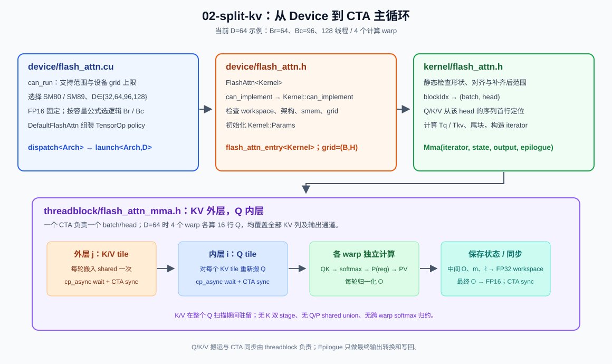
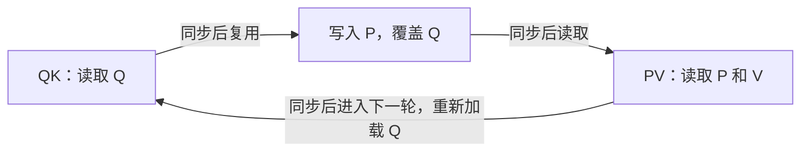

# CUTLASS学习记（八）：Split KV —— 用CUTLASS 重写 FlashAttention（1）

## 前言

- 在论文和秋招的双重压力之后，终于有时间重新写一下这个系列的博客；

- 尽管Fable/Astra大人接近无敌了。但我觉得作为Coding Agent驾驶员，得多写一写博客，防止自己完全跟不上AI节奏。

- 本篇一定程度上经过重置。（之前的路线是沿着cutlass 41 example 一次到底， 但是后来发现从online softmax 到 xformer 风格的fused kernel（带上flash attention2的版本）实在是太快）

- 本篇一定程度上是对FA1原文的重读和CUTLASS2.x的复现。换成 [LeetCUDA 的 flash-attn 路线](https://github.com/xlite-dev/LeetCUDA/tree/main/kernels/flash-attn)，借用cutlass对 MMA PTX（m16n8k16）的包装把 FlashAttention1 重新写一遍。

- FlashAttention1核心就是外层KV循环（也就是Leetcuda所谓的splitkv）， 对应

  ```
  // Split QKV across MMA(Warps) using naive matmul MMA&Warp tiling policy.
  // case: The layout of 8 MMA(2x4)  [after] kWarpTileSeqLenQxkWarpTileSeqLenK(2x2) -> 32x2,32x2=64x64:
  // |  [64,64]  |    warp_KV 0    |    warp_KV 1    |    warp_KV 2    |    warp_KV 3    |
  // | warp_QP 0 |-- MMA 0,MMA 0 --|-- MMA 2,MMA 2 --|-- MMA 4,MMA 4 --|-- MMA 6,MMA 6 --|
  // | warp_QP 0 |-- MMA 0,MMA 0 --|-- MMA 2,MMA 2 --|-- MMA 4,MMA 4 --|-- MMA 6,MMA 6 --|
  // | warp_QP 1 |-- MMA 1,MMA 1 --|-- MMA 3,MMA 2 --|-- MMA 5,MMA 5 --|-- MMA 7,MMA 7 --|
  // | warp_QP 1 |-- MMA 1,MMA 1 --|-- MMA 3,MMA 2 --|-- MMA 5,MMA 5 --|-- MMA 7,MMA 7 --|
  __global__ void // Q, K, V, O -> [B, H, N, D]
  flash_attn_mma_stages_split_kv_kernel(half* Q, half* K, half* V, half* O, ...);
  ```

- 参考资料：
  - [LeetCUDA: kernels/flash-attn](https://github.com/xlite-dev/LeetCUDA/tree/main/kernels/flash-attn) `mma/basic/flash_attn_mma_split_kv.cu`
  - [[2205.14135\] FlashAttention: Fast and Memory-Efficient Exact Attention with IO-Awareness](https://arxiv.org/abs/2205.14135) 原论文第三节
  - CUDA PTX ISA 文档 `mma.sync` / `ldmatrix` 章节

## 从Online Softmax开始说起

- 上一篇说到Online Softmax 把3-pass 降低成2-pass
- 针对Attention 我们不能对各块独立做softmax 然后相加， 借助online softmax 的思想。 我们维护每行的最大值和指数和， 通过缩放系数（也就是最大值的差值缩放）来合并各块。
- 首先针对QKV 的访存进行Tiling。具体在kernel层进行介绍；
- 原文针对score矩阵的每一行维护了 最大值 $\widetilde {m}_{ij}=\operatorname{rowmax}(S*{ij})$ 还有行的所有和$\widetilde\ell_{ij}=\operatorname{rowsum}(\widetilde P_{ij}).$
- 然后还是一样的，根据指数项最大值是否更新计算新的缩放系数，然后更新临时项$\ell_i^{\mathrm{new}}
   =e^{m_i-m_i^{\mathrm{new}}}\ell_i
   +e^{\widetilde m_{ij}-m_i^{\mathrm{new}}}\widetilde\ell_{ij}.$
-  用新的全局基准 $m_i^{\mathrm{new}}$ 重标定旧输出与当前 block 的贡献，并写回 HBM：


## Recap: 一个CUTLASS 风格 的 Kernel

- 在先前我们介绍过一个官方的“cutlass 风格”的kernel是怎么实现的
- 现在我们已经有了一个 flash attention的 algorithm 1， 如何包装这个算法到cutlass 架构里呢？
- 下图对应当前 02-split-kv 的 Device、Kernel 与 Threadblock 分工：




## Device

需要按照原文计算SMem -> Br/Bc

当前 `device/flash_attn.cu` 根据架构和 dtype 选择已实例化的配置，由 `device/flash_attn.h` 中`FlashAttn<Kernel>` 完成初始化和启动。

1. 我是SM89架构（虽然其实除了多了FP8运算和SM80没有什么区别……）
2. dtype 是fp16 （从最常见的开始）

关于启动参数的推导，我运行的机器是 4070 Laptop。在不启动动态shared memory的情况下，这里SRAM的缓存是48KB：
$$
M_{\mathrm{bytes}}=48\times1024=49152,\qquad
M=\frac{M_{\mathrm{bytes}}}{2}=24576.
$$

于是块大小由 $M$ 和 head dimension $d$ 推出：

$$
B_c=\left\lceil\frac{M}{4d}\right\rceil
   =\left\lceil\frac{6144}{d}\right\rceil,\qquad
B_r=\min(B_c,d).
$$

|  $d$ | $B_c$：每块 K/V 的行数 | $B_r$：每块 Q/O 的行数 |
| ---: | ---------------------: | ---------------------: |
|   32 |                    192 |                     32 |
|   64 |                     96 |                     64 |
|   96 |                     64 |                     64 |
|  128 |                     48 |                     48 |

本次案例以 $d=64$ 为例，得到 $B_r=64、B_c=96$。QK 计算的是 $[64,64]\times[64,96]\rightarrow[64,96]$，PV 计算的是 $[64,96]\times[96,64]\rightarrow[64,64]$。

这时 Q/K/V 的 shared storage 分别为 8/12/12 KiB，合计 32 KiB。$O_i,m_i,\ell_i$ 不在 shared 中另开空间：当前 $Q_i$ 的状态进寄存器，跨 KV 轮次则放在 FP32 workspace。每个 head 为 $\lceil S_q/B_r\rceil B_r$ 行预留 $(D_v+2)$ 个 FP32 值；例如 $S_q=1024,D_v=64$ 时为 $1024\times66\times4=270336$ B。

## Kernel

类似标准的[GEMM kernel](https://github.com/NVIDIA/cutlass/blob/147295a3d4b75f3aeff247c25b8927cea9a7006a/include/cutlass/gemm/kernel/gemm.h#L203)，Kernel 入口负责定位 CTA、构造初始 iterator，再把循环交给 threadblock Mma。这里参考了 LeetCUDA 的[朴素实现](https://github.com/xlite-dev/LeetCUDA/blob/main/kernels/flash-attn/mma/basic/flash_attn_mma_split_kv.cu)， 但是仍然还是按照cutlass example 13 和原文的Algorithm 1实现。

### Grid / 早退逻辑

- Grid 是 `(batch, head, 1)`，一个 CTA 负责一个 batch/head。
- identity swizzle 给出该 CTA 的 `(batch, head, 0)` 坐标；Kernel 在构造 iterator 前做范围判断。
- $T_r=\lceil S_q/B_r\rceil$ 和 $T_c=\lceil S_{kv}/B_c\rceil$ 是 CTA 内两个循环的次数，不是 Grid 的两个维度。

### Kernel Tiling

- Algorithm 1 第 2 行的 $O_i=0,\ell_i=0,m_i=-\infty$，在第一个 KV tile 处理当前 $Q_i$ 时初始化到寄存器；后续 KV 轮次从 FP32 workspace 读取上轮状态。不需要先把整段 workspace 清零。


- 固定 `(batch, head)` 后，Kernel 从该 head 的 sequence 第 0 行构造 Q/K/V iterator。这里的 `head × D` 是 BSHD 的存储列偏移，不是 $Q_i$ 或 $K_j$ 的 tile 编号。
- 真正的 tile 起点在 threadblock 双层循环中：外层 $j$ 对应 $K_j,V_j$ 的 `(jB_c,0)`，先加载到 shared 并等待完成；内层 $i$ 对应 $Q_i$ 的 `(iB_r,0)`。Q/K/V 的 iterator 在各自循环内按完整 tile 推进，尾块用有效行数屏蔽。
- QK 沿 $D$ 的 MMA 指令循环仍由 warp 层负责；$j$ 与 $i$ 不分配给其他 CTA。


### 构造组件 Iterator / Mainloop / Epilogue 

1. **构造输入 iterator。** Kernel 用 `Params` 中预计算的 stride、输入指针、extent 和 tile 起点构造 Q/K/V 的 CUTLASS global access iterator。`canonical_warp_idx_sync()` 给出 warp-uniform 的 warp id，用于随后构造 Mma。
2. **进入 Mainloop。** Kernel 把 iterator、$T_c/T_r$ 和序列长度交给 Mma。Mma 在首个 KV 轮次为每个 $Q_i$ 初始化 $O_i,\ell_i,m_i$，之后按 KV 外层、Q 内层读写 FP32 workspace；shared/warp iterator 与同步留在 Mainloop 内部。
3. **组装 Epilogue。** 定位输出 tile，构造 CUTLASS output tile iterator，交给 Epilogue 转换成 FP16 并写回。每轮的归一化已经在 Mainloop 内完成。


## Threadblock：Mainloop

> Q: 你能大概概括一下Threadblock Mainloop的职责是什么吗？参考CUTLASS GEMM 2.x API
>
> AI: 外层流式扫描 K/V， 然后把Share memory组织好，存放对应的K_i, V_j。准备Mainloop 进入遍历Q主循环。

1. 加载Q(第8行)

2. **计算 QK 和行最大值**（第 9、10 行）

   Warp MMA 计算 $S_{ij}=Q_iK_j^T/\sqrt D$，结果留在寄存器中。每个 warp 先求自己负责的 24 列的行最大值。

   同一行的数据分散在四个相邻线程中，CUTLASS 源码将这样的四线程组称为 quad。组内通过 shuffle 合并后，由第一个线程写入 `row_max[warp_][row]`。这些线程在各自 warp 内的 lane 编号是 0、4、8……28。

   CTA 同步后，各 warp 读取同一行的四份结果，合并得到当前 tile 的行最大值 $\tilde m_{ij}$。此时所有 warp 也都读完了 Q，它占用的空间可以交给 P。

3. **更新 softmax**（第 10、11 行）

   先用当前 tile 自己的行最大值，计算第 10 行的指数和行和：

   $$
   \tilde P_{ij}=\exp(S_{ij}-\tilde m_{ij}),\qquad
   \tilde\ell_{ij}=\operatorname{rowsum}(\tilde P_{ij}).
   $$

   各 warp 将 $\tilde P$ 写入 shared memory，同时计算局部行和，写入 `row_sum`。同步 CTA 后合并四份行和，再计算第 11 行：

   $$
   m_i^{\mathrm{new}}=\max(m_i,\tilde m_{ij}),\qquad
   \alpha=\exp(m_i-m_i^{\mathrm{new}}),\qquad
   \beta=\exp(\tilde m_{ij}-m_i^{\mathrm{new}}).
   $$

   $$
   \ell_i^{\mathrm{new}}
   =\alpha\ell_i+\beta\tilde\ell_{ij}.
   $$

   代码里的 `tile_max` 对应 $\tilde m$，`maximum` 对应历史 $m$，`denominator` 对应 $\ell$。覆盖旧分母之前，用 `previous_weight` 保存 $\alpha\ell_i$，留给输出更新。

   shared memory 中名为 `p` 的 buffer 现在存放 $\tilde P$。它转换成 FP16 后用于 PV；行和使用转换前的 FP32 数值计算。这里既没有除以 denominator，也没有提前乘入 $\beta$。

4. **计算 PV，更新输出**（第 12 行）

   Warp MMA 从零开始计算当前 tile 的 $\tilde P_{ij}V_j$，结果放在 FP32 的 `tile_output` 中。然后按行合并旧 O 与当前 tile 的贡献：

   $$
   O_i^{\mathrm{new}}
   =\operatorname{diag}(\ell_i^{\mathrm{new}})^{-1}
    \left(\operatorname{diag}(\alpha\ell_i)O_i
    +\operatorname{diag}(\beta)\tilde P_{ij}V_j\right).
   $$

   对应代码中的每个输出元素：

   ```cpp
   int r = WarpPV::row_slot(i);
   output[i] = (previous_weight[r] * output[i] + beta[r] * tile_output[i])
               / denominator[r];
   ```

   除法放在本轮 PV 和两项合并之后。下一轮拿到的 `output` 已经是归一化的 O，所以必须乘回旧 $\ell$，不能只乘 $\alpha$。

   第一轮从 $O=0,\ell=0,m=-\infty$ 开始，$\alpha=0,\beta=1$，自然得到 $O=\tilde P V/\tilde\ell$。sequence 尾块的无效 KV 列在求最大值前设为 $-\infty$，对应 $\tilde P=0$；跨 warp 合并 tile 最大值后，全部列无效的单个 warp 也不会单独计算 $-\infty-(-\infty)$。

5. **同步，进入下一轮**

   PV 结束后同步 CTA，确保所有 warp 都读完了 P 和 V，再推进 K/V iterator。下一轮重新加载 Q/K/V，覆盖这些 shared buffer。


### CTA： Scan K/V

将外层循环的$K_j$、$V_j$ 放入 shared memory。K/V 通过 `cp_async` 搬运，V 在搬运时调整布局。等待 K/V 搬运完成，再同步 CTA，所有 warp 才开始读取。·


- K和 V被切分成$T_c$块， 每轮读取 K/V tile $K_j,V_j$(公式按照自己的理解来)

$$
S_{ij}=Q_iK_j^T/\sqrt D,\qquad
\tilde m_{ij}=\operatorname{rowmax}(S_{ij}),\qquad
\tilde P_{ij}=\exp(S_{ij}-\tilde m_{ij}),\qquad
\tilde\ell_{ij}=\operatorname{rowsum}(\tilde P_{ij}).
$$

$$
m_i^{\mathrm{new}}=\max(m_i,\tilde m_{ij}),\qquad
\alpha=e^{m_i-m_i^{\mathrm{new}}},\qquad
\beta=e^{\tilde m_{ij}-m_i^{\mathrm{new}}},\qquad
\ell_i^{\mathrm{new}}=\alpha\ell_i+\beta\tilde\ell_{ij}.
$$


### Warp 协作：内部Q主循环

继续用 $D=64$、$B_r=64$、$B_c=96$ 的例子。一个 CTA 有四个 warp，QK 沿 score 的列方向划分，PV 则沿输出通道划分：

| warp | QK 负责的 KV 位置 | PV 负责的输出通道 |
|---:|---|---|
| 0 | `[0,24)` | `[0,16)` |
| 1 | `[24,48)` | `[16,32)` |
| 2 | `[48,72)` | `[32,48)` |
| 3 | `[72,96)` | `[48,64)`- |

- 每个 warp 都处理这 64 行 Q。QK 的 warp tile 是 `[64,24]`，但一行 softmax 需要全部 96 个 score，因此要合并四个 warp 的行最大值和行和。

- 到了 PV，每个 warp 计算 `[64,16]` 的输出，需要沿全部 96 个 KV 位置累加。QK 阶段由一个 warp 生成的 24 列 P，只是 PV 输入的一部分。所以先把 P 写入 shared memory，再由 PV 的 warp iterator 读取。

### CTA 内同步

论文 Algorithm 1 外层遍历 KV tile，内层遍历 Q tile，并逐轮读写 HBM 中的 $O,m,\ell$。这里将不同 Q tile 分给不同 CTA，每个 CTA 固定 $Q_i$，遍历全部 KV tile，将 $O_i,m_i,\ell_i$ 留在寄存器中。下面按第 10～12 行实现 softmax 和逐轮归一化；CTA 调度和中间状态的存储位置仍是本实现的安排。

1. 


### Shared memory

Q 只在 QK 阶段使用，P 则在 QK 结束后生成。两者在 shared memory 中的使用时间错开，可以通过 `union` 共用一块空间。寄存器中的 score 已经保存了 QK 的结果，生成 P 时不再需要读取 Q。



代价是每轮都要重新加载同一个 Q tile。换来的空间可以直接算出来。对于 $D=64$、$B_r=64$、$B_c=96$：

| Shared memory 内容 | 容量 |
|---|---:|
| Q/P 共用空间 | $\max(64\times64,64\times96)\times2=12\,288$ B |
| K | $96\times64\times2=12\,288$ B |
| V | $96\times64\times2=12\,288$ B |
| 四个 warp 的 `row_max` 和 `row_sum` | $2\times4\times64\times4=2\,048$ B |
| 合计 | $38\,912$ B，即 38 KiB |

Q/P 复用后，这组 tile 可以放进 48 KiB 的静态 shared memory。$O$、$m$、$\ell$ 使用 FP32 寄存器保存，PV 还需要当前 tile 的 `tile_output` fragment。每个 warp 负责不同的输出通道，但每轮归一化时需要相同的行分母，所以它们各自保留一份 $m$ 和 $\ell$。

### Iterator

- `DefaultFlashAttn` 组装 
  - global iterator：`PredicatedTileAccessIterator` 给出读取地址及边界判断
  - shared iterator ： `RegularTileAccessIterator` 给出写入地址
  - warp MMA。
  - ThreadMap 决定每个线程搬哪些元素；

Q/K 每次访问 8 个 FP16 元素，通过 16-byte `cp_async_zfill` 写入 shared memory。V 需要改变存储顺序，使用 global load 和转置 ThreadMap 完成写入。搬运结束后，`cp_async_wait<0>()` 等待 Q/K 的异步拷贝，`__syncthreads()` 再让整个 CTA 一起进入计算。

以 $D=64$ 为例，warp MMA 看到的矩阵如下：

| 数据 | Shared layout | MMA 中的形状与用途 |
|---|---|---|
| Q | RowMajor | `[64,64]`，QK 的 A |
| Kᵀ | ColumnMajor | `[64,96]`，QK 的 B |
| P | RowMajor | `[64,96]`，PV 的 A |
| V | ColumnMajor | `[96,64]`，PV 的 B |

K 的每个 sequence 行沿 D 连续存放。复制到 shared memory 后，`[KV,D]` 的行优先存储作为 `[D,KV]` 的列优先视图就是 Kᵀ，因此复制 K 时不需要重排元素。


V 在 PV 中仍是 `[KV,D]`，为了让列优先的 B iterator 读取它，需要在写入 shared memory 时重排。


逻辑 tile 的宽度与指令覆盖的宽度也要分开。例如 $D=128$ 时，论文公式给出 $B_c=48$；每个 QK warp 的 12 列向上对齐到 8 的倍数，变成 16 列，四个 warp 实际覆盖 64 列。额外的 K/V 位置填零，softmax 前将无效 score 置为 $-\infty$，让对应的 P 为零。K/V iterator 仍按逻辑 tile 宽度 48 推进。

## Warp MMA

[FlashAttnWarpMma](/D:/code/cuda/tiny-cutlass/csrc/flash-attention/02-split-kv/warp/flash_attn_mma.h) 按 example 19 的方式组合 `DefaultMmaTensorOp`，使用 `m16n8k16` 完成矩阵乘法。每推进一组 K=16，先由 warp iterator 加载 A/B fragment，经过 `mma.transform()` 转成 MMA 使用的 operand fragment，再执行累加。

这里有两个不同的累加维度：QK 沿 head dimension D 推进，PV 沿 KV 位置推进。对于 $D=64$、$B_c=96$，QK 需要 4 组 K=16，PV 需要 6 组 K=16。QK 的 `[64,24]` warp tile 由 $4\times3$ 个 `m16n8` 输出块组成；PV 的 `[64,16]` 则由 $4\times2$ 个输出块组成。

矩阵乘法交给 CUTLASS 后，softmax 还要回答一个问题：**线程手里的某个 accumulator，属于 score 的哪一行？**

对于单个 `m16n8k16` 的 FP32 输出，每个线程持有四个值。以 lane 0～3 为例：

| lane | `c0,c1` 的位置 | `c2,c3` 的位置 |
|---:|---|---|
| 0 | 第 0 行，第 0、1 列 | 第 8 行，第 0、1 列 |
| 1 | 第 0 行，第 2、3 列 | 第 8 行，第 2、3 列 |
| 2 | 第 0 行，第 4、5 列 | 第 8 行，第 4、5 列 |
| 3 | 第 0 行，第 6、7 列 | 第 8 行，第 6、7 列 |

这就是前面按四线程组归约的原因。每个线程先合并自己持有的同一行数据，再用 XOR shuffle 的 1、2 两个偏移合并组内结果。四个线程都得到相同的局部最大值或局部行和，只需要其中一个写入 shared memory。

扩大到整个 warp tile 后，还要考虑多个 `m16n8` 输出块在 fragment 中的排列。这里 `MmaTensorOp` 使用默认的 `AccumulatorsInRowMajor=false`，输出块按 `m + n * MmaIterations::kRow` 编号。因此我们为 attention 的逐行操作补上三个映射：`row_slot(i)` 找到元素对应的行统计槽位，`row(slot,lane)` 得到 tile 内行号，`column(i,lane)` 得到 tile 内列号。

行最大值、行和、P 的 shared store 和输出的逐行归一化都使用这组映射。它们属于 attention 自己的 softmax 逻辑；CUTLASS 提供的是 iterator、fragment 和 MMA 运算。

## Epilogue：转换和写回

扫完所有 KV tile 后，每个 warp 已经持有自己负责的归一化输出 O。Algorithm 1 第 12 行的除法已经在每轮 Mainloop 中完成，Epilogue 不再接收 denominator。

[FlashAttnEpilogue](/D:/code/cuda/tiny-cutlass/csrc/flash-attention/02-split-kv/epilogue/flash_attn_epilogue.h) 用 `FragmentIteratorTensorOp` 逐个取出行片段，转换成 FP16，再通过 `TileIteratorTensorOpCanonical` 写回。Kernel 构造输出 iterator 时给出当前 warp 的输出通道起点和有效行数，sequence 尾部不足一个 Q tile 时，只写有效行。

论文在每个 KV tile 后写回 $O$、$m$、$\ell$；这里由同一个 CTA 完成一个 Q tile 的全部 KV 扫描，把中间结果留在寄存器中，最后只写一次 O。这个存储安排不改变逐轮归一化：softmax 的合并和输出更新都在 Mainloop 内完成，Epilogue 负责最终转换和写回。

## 源码对照

| 阅读内容 | 参考位置 |
|---|---|
| 分块、在线 softmax 与输出更新 | [FlashAttention Algorithm 1，第 6～13 行](https://arxiv.org/pdf/2205.14135#page=5) |
| Mma 内部组织 iterator 和搬运 | [CUTLASS example 13：`copy_tiles_and_advance_0()`](https://github.com/NVIDIA/cutlass/blob/1732ed7da3b81d9f28b0130370ba70755a7e6dda/examples/13_two_tensor_op_fusion/threadblock/b2b_mma_multistage.h#L311) |
| Canonical TensorOp 的组装 | [CUTLASS example 19：`DefaultMmaTensorOp`](https://github.com/NVIDIA/cutlass/blob/1732ed7da3b81d9f28b0130370ba70755a7e6dda/examples/19_tensorop_canonical/tensorop_canonical.cu#L95) |
| Accumulator fragment 的排列 | [CUTLASS `MmaTensorOp`](https://github.com/NVIDIA/cutlass/blob/1732ed7da3b81d9f28b0130370ba70755a7e6dda/include/cutlass/gemm/warp/mma_tensor_op.h#L314) |
| 本文的 KV 主循环与行归约 | [FlashAttnMma](/D:/code/cuda/tiny-cutlass/csrc/flash-attention/02-split-kv/threadblock/flash_attn_mma.h) |

## Profile

- 测试设备为 RTX 4070 Laptop SM89。
- 覆盖 D=32/64/96/128、首轮与多轮 KV、Q/KV 尾块、零输入、放大输入及非默认 stream 上的重复调用。
- 最大 MAE 为 $2.35897\times10^{-5}$，最大绝对误差为 $9.76562\times10^{-4}$


| B | H | N | D | 00 naive / ms | 01 online softmax / ms | 02 split-KV / ms |
|---:|---:|---:|---:|---:|---:|---:|
| 1 | 1 | 256 | 64 | 0.040565 | 0.037617 | 0.026070 |
| 1 | 4 | 1024 | 64 | 0.118764 | 0.118395 | 0.148660 |
| 1 | 4 | 1024 | 128 | 0.159990 | 0.175019 | 0.856330 |
| 16 | 12 | 1024 | 64 | 8.998480 | 8.996820 | 5.127740 |


### D=128 为什么慢下来？

第二、三行只把 D 从 64 改成 128，02 的耗时却增加到约 5.76 倍。这里不只是矩阵乘法的计算量翻倍：分块从 $(B_r,B_c)=(64,96)$ 变成 $(48,48)$，每个 CTA 扫描 KV 的轮数从 11 增加到 22，整个 grid 的 CTA 数也从 64 增加到 88。Q/P 复用 shared memory，所以每轮还要重新加载 Q，再完成 softmax、输出更新和同步。

通过 reference 校验后，对这两个形状单独采集 NCU。同一份 Release 二进制保留了 line info；跳过前两次匹配的 kernel，只采集一次 `flash_attn_entry`，使用 kernel replay、`cache-control=all`、`clock-control=none`。下面的耗时和执行指标取自各自的 detail 报告，shared wavefront 取自 source 报告，不与普通 benchmark 的计时混用。

| NCU 指标 | D=64 | D=128 |
|---|---:|---:|
| Kernel 耗时 / μs | 150.91 | 855.17 |
| Registers / thread | 228 | 254 |
| 理论 occupancy | 16.67% | 16.67% |
| Eligible warps / scheduler / active cycle | 0.26 | 0.15 |
| Tensor pipe 利用率（elapsed） | 10.43% | 4.87% |
| Shared excessive wavefronts | 5,091,328 | 27,724,428 |

最突出的差别在 shared memory。把 excessive wavefront 按源码行汇总，可以看到它们主要落在哪里：

| Shared 访问位置 | D=64 | D=128 |
|---|---:|---:|
| [V 转置写入，`copy_tiles()` 第 115 行](../../csrc/flash-attention/02-split-kv/threadblock/flash_attn_mma.h#L115) | 2,027,520 | 15,364,096 |
| [Canonical A operand 读取，Q/P](../../3rdparty/cutlass/include/cutlass/gemm/warp/mma_tensor_op_tile_iterator_sm80.h#L1872) | 1,959,936 | 7,047,040 |
| [Canonical B operand 读取，K/V](../../3rdparty/cutlass/include/cutlass/gemm/warp/mma_tensor_op_tile_iterator_sm80.h#L1901) | 619,520 | 3,252,480 |
| [P 写入，第 216 行](../../csrc/flash-attention/02-split-kv/threadblock/flash_attn_mma.h#L216) | 202,752 | 650,496 |

V 的问题可以直接从地址看出来。这里没有 swizzle，shared 中的 V 按 `kv + d * kStorageBc` 存储，同一 warp 的相邻 lane 沿 d 写入。D=64 时 `kStorageBc=96`，相邻 lane 相隔 192 字节；D=128 时逻辑 $B_c=48$，物理补齐为 64，相邻 lane 相隔 128 字节。按照 [32 个 bank、连续 32-bit word 依次映射到 bank 的规则](https://docs.nvidia.com/cuda/cuda-c-best-practices-guide/index.html#shared-memory-and-memory-banks)，前者只落到两个 bank，后者全部落到同一个 bank，而且是不同地址，不能广播。对应这行 store，NCU 的 actual / ideal wavefront 正好从 **16 倍变成 32 倍**。

MMA operand 的 shared 读取同样有冲突。D=128 的 source 采样中，A operand 读取、V 转置写入、B operand 读取分别出现 4,614、4,086、1,930 个 `mio_throttle` stall samples，与这些访问的 excessive wavefront 相互印证。采样数不是耗时占比，wavefront 数也不能直接换算成可获得的加速比。

因此，第三行的主要热点是**更多的 KV 轮次叠加严重的 shared bank conflict**，而不是 Tensor Core 算力已经用满。寄存器占用确实很高，但两个形状都受限于每个 SM 最多驻留两个 CTA，不能把差距解释成理论 occupancy 又下降了一档。D=128 还出现了 local load/store 流量，不过 local memory 也可能来自线程局部数组，不能把全部流量都当作 spill。

原始报告与导出文件放在下面。Raw CSV 是 NCU 原生 `--page raw --csv --print-units base` 导出；热点 CSV 是从 source 报告逐 PC 关联源码后按行汇总，二者分开保留。

| 形状 | NCU 报告 | Raw CSV | 源码热点 CSV |
|---|---|---|---|
| D=64 | [detail](../../build/split-kv-study/profile/20260924-fa1-hotspots/reports/detail_d64.ncu-rep) · [source](../../build/split-kv-study/profile/20260924-fa1-hotspots/reports/source_d64.ncu-rep) | [detail raw](../../build/split-kv-study/profile/20260924-fa1-hotspots/analysis/detail_d64-raw.csv) · [source raw](../../build/split-kv-study/profile/20260924-fa1-hotspots/analysis/source_d64-raw.csv) | [hotspots](../../build/split-kv-study/profile/20260924-fa1-hotspots/analysis/hotspots_d64.csv) |
| D=128 | [detail](../../build/split-kv-study/profile/20260924-fa1-hotspots/reports/detail_d128.ncu-rep) · [source](../../build/split-kv-study/profile/20260924-fa1-hotspots/reports/source_d128.ncu-rep) | [detail raw](../../build/split-kv-study/profile/20260924-fa1-hotspots/analysis/detail_d128-raw.csv) · [source raw](../../build/split-kv-study/profile/20260924-fa1-hotspots/analysis/source_d128-raw.csv) | [hotspots](../../build/split-kv-study/profile/20260924-fa1-hotspots/analysis/hotspots_d128.csv) |

采集命令、二进制校验值、reference 校验和复测记录见[采集附件](../../build/split-kv-study/profile/20260924-fa1-hotspots/REPORT.md)。


##  LeetCUDA

源码第 60 行通过 `blockIdx.x` 选定 `Q_tile_id`，第 214 行循环遍历 KV，launcher 则把不同 Q tile 分配给不同 CTA：

```
不同 CTA 分别负责不同 Q tile i

每个 CTA 内：
    加载固定的 Q_i
    for 每个 KV tile j:
        加载 K_j、V_j
        计算并更新这个 Q tile 对应的输出
    写回输出
```


```
for j in KV tiles:
    加载 K_j、V_j，整个内层循环保持驻留

    for q in Q tiles:
        首轮初始化 O、m、ℓ，否则读取旧状态
        加载 Q_q
        QK → softmax 统计合并 → PV → 本轮归一化

        中间轮：写回 FP32 O
        最后一轮：转换并写出 FP16 O
        写回 m、ℓ
```

## 后记

从上一篇的 online softmax 走到这里，终于把 QK、softmax 和 PV 接进了同一个 CTA。写这一篇时，我也在重新理解 CUTLASS 的分层：Kernel 定位 tile，Threadblock 推进循环，Warp 完成矩阵乘法；attention 自己需要补上的，是两次 MMA 之间的行归约和在线更新。

论文的容量公式给出了分块的起点，真正落到代码里，还要考虑 fragment 怎么分到线程、P 怎么交给下一次 MMA，以及 shared memory 什么时候可以复用。Q/P 共用空间确实把容量控制住了，同时也带来了重复加载 Q 的代价。NCU 又把寄存器占用和 shared 访问的问题摆了出来。

这次大批量 D=64 得到了收益，小批量和 D=128 则还有明显差距。下一步我想先处理 V 转置写入和 warp 读取的布局，保留其余计算流程做对比，再考虑调整 tile 和流水线。这样才能知道每次改动到底解决了哪个问题。
