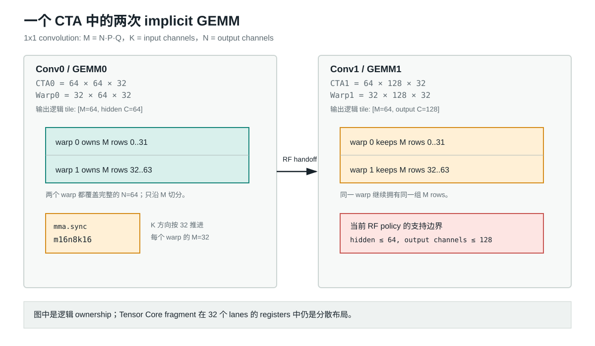
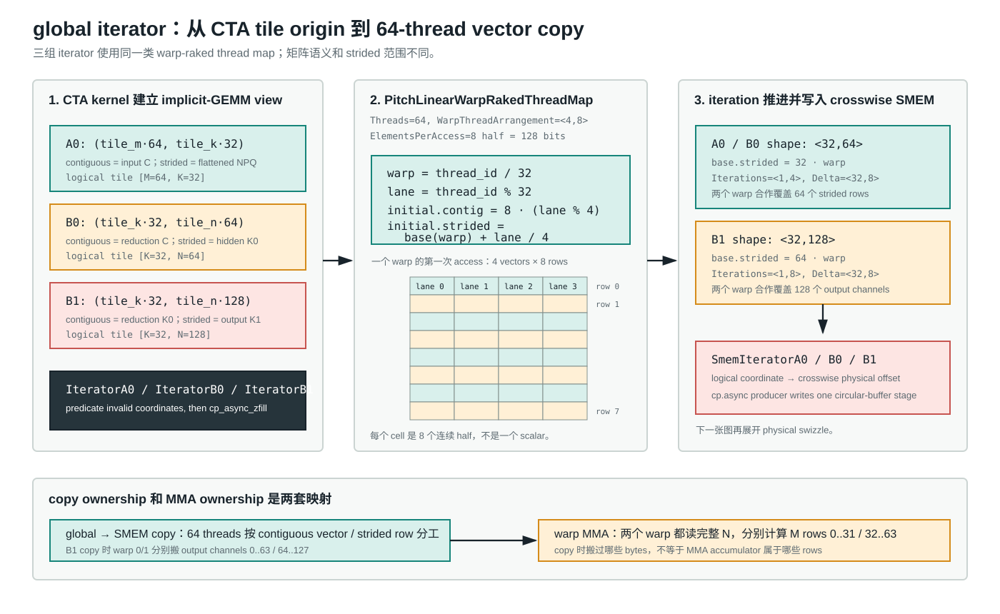
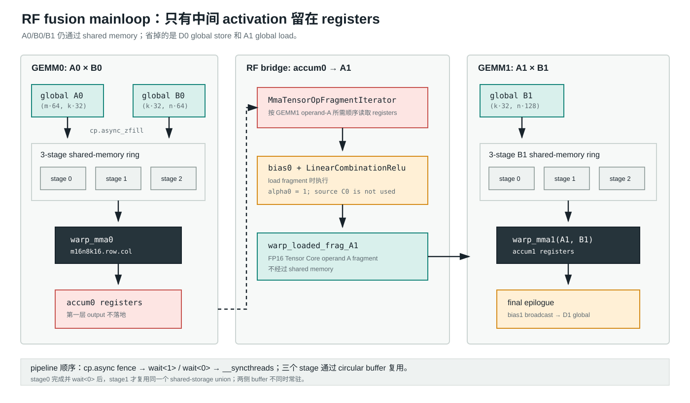
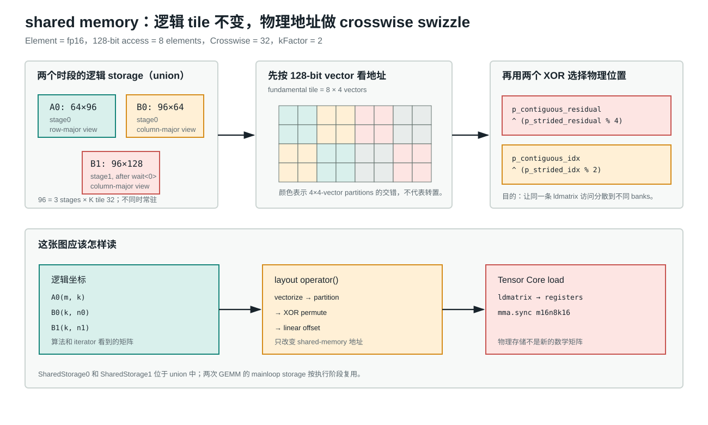
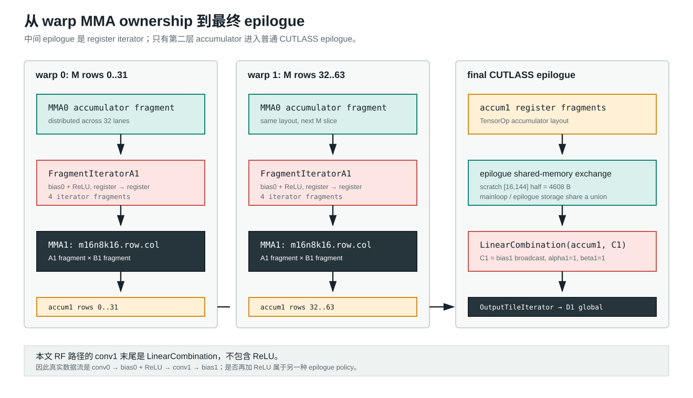

# CUTLASS 学习记：Implicit GEMM Fusion

## 前言

在工作的时候遇到融合算子问题，一直清楚有两种方式融合：register file 和 shared
memory，但是一直不知道：

1. 这两者性能有什么区别：总感觉寄存器应该是性能更好的，但是限制于数量条件更苛刻；
2. 什么时候该用 RF，什么时候该用 shared memory：比如之前的 FlashAttention 就是用 shared memory 存储。

为此回到一开始的卷积，先抄一遍 CUTLASS 的两层 convolution fusion。

参考代码：

- `3rdparty/cutlass/examples/13_two_tensor_op_fusion/fused_two_convs_f16_sm80_rf.cu`
- `3rdparty/cutlass/examples/13_two_tensor_op_fusion/kernel/default_b2b_conv2d_fprop_sm80.h`
- `3rdparty/cutlass/examples/13_two_tensor_op_fusion/kernel/b2b_implicit_gemm_convolution.h`
- `3rdparty/cutlass/examples/13_two_tensor_op_fusion/threadblock/b2b_implicit_gemm_multistage.h`

本篇我们先以register file 融合为例， 下一篇我们再深入smem的融合。

## Overview

一开始想看的逻辑算子是两层 convolution fusion：

```text
conv0 -> bias0 + ReLU -> conv1 -> bias1 + ReLU
```

不过先把当前本地实例说准确：`threads::Conv0Relu` 是
`LinearCombinationRelu`，`threads::Conv1Linear` 是 `LinearCombination`。所以这篇真正验证的
RF 路径是：

```text
conv0 -> bias0 + ReLU -> conv1 -> bias1
```

第二个 ReLU 可以换 epilogue policy 加上，但不在这次已经通过 reference parity 的实例里。

源码从外到内分为下面几层：

```text
ops::conv1x1_dual
  -> device::Conv1x1Dual
  -> kernel::DefaultConv1x1Dual
  -> kernel::DefaultB2bConv2dFprop
  -> threadblock::B2bImplicitGemmMultistage
  -> kernel::B2bImplicitGemmConvolution
  -> device::B2bImplicitGemmConvolution
```

这篇按数据的实际流向读这条路径：

1. 两个 1x1 convolution 怎样映射成两个 implicit GEMM，以及一个 CTA/两个 warp 怎样切 tile；
2. `DefaultB2bConv2dFprop` 怎样装配 global iterator、shared-memory iterator、warp MMA 和 epilogue；
3. A0/B0/B1 怎样经过三阶段 `cp.async` ring，crosswise layout 又改变了什么；
4. `accum0` 怎样经过 `MmaTensorOpFragmentIterator` 在 register file 内成为 A1；
5. 第二层 accumulator 怎样经过普通 CUTLASS epilogue，加 bias1 后写回 global memory。

这里先只解释 RF 版本。SMEM accumulator 版本已经能构建和通过 reference parity，但它的
`accumulator -> shared memory -> A1` 交接留到下一篇。性能差异也不先猜，等两条路径都有
NCU 实测后再写进 `Profile`。

## 两次 implicit GEMM 和一个 CTA

CUTLASS 把 convolution fprop 写成 GEMM：

$$
(M,N,K)=(N_{batch}P Q, K_{out}, R S C_{in})
$$

对 1x1 convolution，$R=S=1$，所以两层分别是：

```text
GEMM0: A0[NPQ, C0] @ B0[C0, K0] -> D0[NPQ, K0]
GEMM1: A1[NPQ, K0] @ B1[K0, K1] -> D1[NPQ, K1]
```

`A1` 在数学上就是 `relu(D0 + bias0)`。RF fusion 的关键不是改变这两个 GEMM，而是让
`D0` 不成为 global-memory tensor，甚至不成为 shared-memory tensor。



本地默认 policy 是：

```cpp
using ThreadblockShape0 = GemmShape<64,  64, 32>;
using WarpShape0        = GemmShape<32,  64, 32>;
using ThreadblockShape1 = GemmShape<64, 128, 32>;
using WarpShape1        = GemmShape<32, 128, 32>;
using InstructionShape  = GemmShape<16,   8, 16>;
```

两个阶段的 `WarpCount` 都是 `(2, 1, 1)`，所以 CTA 只有 64 threads。warp 0 持有 M rows
`0..31`，warp 1 持有 `32..63`；这个 M ownership 在两次 MMA 之间不变。

当前 `can_implement()` 还要求 hidden channels `<= 64`、output channels `<= 128`。因此
默认有效问题的 grid N 实际为 1，同一个 CTA 不是先后启动两套独立 grid，而是在一次
kernel launch 内顺序完成自己的 GEMM0 和 GEMM1 tile。

## Kernel Level：从 policy 到 `CutlassKernel`

本地入口 `kernel/conv1x1_dual.h` 没有重新实现 implicit GEMM。它固定本次实验的 tile，
再把 arch、element type 和 residency 继续作为模板 policy 传给 factory：

这里有两个容易混淆的 architecture 名字。本地 operator 显式实例化的是
`cutlass::arch::Sm80` policy，也就是本文追踪的 example 13 SM80 TensorOp 路径；当前仓库
为了本机 Ada GPU 用 `CMAKE_CUDA_ARCHITECTURES=89` 生成 cubin。前者决定 CUTLASS 选哪套
MMA/pipeline policy，后者决定 NVCC 为哪种实际 GPU 生成代码。

```cpp
using CutlassKernel = typename cutlass::conv::kernel::DefaultB2bConv2dFprop<
    ConvType, Element, Layout, Element, Layout,
    Element, Layout, Element, Element,
    ArchTag, OperatorClass,
    ThreadblockShape0, WarpShape0,
    ThreadblockShape1, WarpShape1,
    EpilogueOutputOp0, EpilogueOutputOp1,
    ThreadblockSwizzle, Stages,
    MathOperator, IteratorAlgorithm, SmemAccumulator>::Kernel;
```

`DefaultB2bConv2dFprop` 的 primary template 只做分派。RF 的 SM80 specialization 在
`kernel/default_b2b_conv2d_fprop_sm80.h`，它先用两次 `DefaultMmaCore` 得到两套
`MmaPolicy` 和 shared-memory iterator，再组出下面两个最重要的类型：

```cpp
using FragmentIteratorA1 = cutlass::gemm::warp::MmaTensorOpFragmentIterator<
    ...,
    ElementAccumulator, ElementA, AccumulatorLayout,
    InstructionShape, EpilogueOutputOp0>;

using B2bMma = threadblock::B2bImplicitGemmMultistage<
    ThreadblockShape0,
    IteratorA0, SmemIteratorA0, ...,
    IteratorB0, SmemIteratorB0, ...,
    ThreadblockShape1,
    FragmentIteratorA1,
    IteratorAccumulatorScaleBias,
    FragmentIteratorA1ScaleBias,
    IteratorB1, SmemIteratorB1, ...>;
```

这里没有 global-memory `IteratorA1`。第二层 A operand 来自 `FragmentIteratorA1`，
也就是第一层 MMA 的 accumulator fragment。

factory 最后只是把 `B2bMma` 和第二层 global-memory epilogue 拼成 CTA kernel：

```cpp
using Kernel = cutlass::conv::kernel::B2bImplicitGemmConvolution<
    B2bMma, Epilogue, ThreadblockSwizzle, conv::Operator::kFprop>;
```

这也是为什么要先读 `DefaultB2bConv2dFprop`：真正决定 RF 或 SMEM handoff 的，不是最外层
launcher，而是 factory 选择的 `B2bMma` 类型。

## CTA kernel：建立三组 global iterator

`device::B2bImplicitGemmConvolution` 负责 `can_implement()`、`initialize()` 和 kernel
launch。进入 device 后，`kernel::B2bImplicitGemmConvolution::operator()` 为当前 CTA
构造 `IteratorA0`、`IteratorB0` 和 `IteratorB1`。它们的逻辑 tile origin 是：

```text
A0: (tile_m * 64,  tile_k * 32)
B0: (tile_k * 32, tile_n * 64)
B1: (tile_k * 32, tile_n * 128)
bias0: (0, tile_n * 64)
```

global tensor 的真实 layout 仍是 NHWC。这里的 A row-major、B column-major 是
`DefaultMmaCore` 看见的 implicit-GEMM 逻辑坐标，不要把它和 global NHWC 或后面的
shared-memory crosswise layout 混在一起。

CTA 随后清空两组 accumulator，并进入唯一的 back-to-back mainloop：



三组 global iterator 的 thread map 都来自 `DefaultMmaCore`：

```cpp
PitchLinearWarpRakedThreadMap<Shape, 64, PitchLinearShape<4, 8>, 8>
```

最后的 `8` 表示每个 thread 每次访问 8 个连续 fp16，也就是 128 bits。令
`warp = thread_id / 32`、`lane = thread_id % 32`，第一次 access 的 pitch-linear
coordinate 是：

```text
contiguous = 8 * (lane % 4)
strided    = warp_base + lane / 4
```

对 A0/B0，thread map shape 是 `<32, 64>`，每个 warp 的 strided base 相差 32，
`Iterations=<1,4>`；对 B1，shape 是 `<32,128>`，base 相差 64，
`Iterations=<1,8>`。二者的 `Delta` 都是 `<32,8>`。因此 64 threads 会合作把整个
global tile 搬入当前 shared-memory stage，越界 access 由 predicate 和
`cp_async_zfill` 处理。

这里还要区分 copy ownership 和 MMA ownership。比如搬 B1 时，两个 warp 分别负责一半
output-channel rows；进入 `warp_mma1` 后，两个 warp 都会读取完整 N=128，真正的
accumulator ownership 仍然沿 M 切成 `0..31` 和 `32..63`。

```cpp
B2bMma b2bMma(shared_storage.main_loop, thread_idx, warp_idx, lane_idx);

typename B2bMma::FragmentC0 src_accum;
typename B2bMma::FragmentC1 accumulators;
src_accum.clear();
accumulators.clear();

b2bMma(params.gemm_k_iterations_0, accumulators,
    iterator_A0, iterator_B0,
    iterator_Scale0, iterator_Bias0, iterator_B1,
    src_accum, output_op_0);
```

`accumulators` 是第二层 output tile；第二层完成后，kernel 中唯一普通的 epilogue
才把它写到最终 `D1`。

## `B2bImplicitGemmMultistage` 的两段 pipeline



前半段就是第一层 implicit GEMM：`A0/B0` 从 global memory 异步搬到 shared memory，
warp MMA 累加到 `accum0`。`Stages=3` 的含义是同一组 K tiles 有三个 circular-buffer
slots，不是有三个算子。

prologue 先用 `cp_async_zfill` 填满 `Stages - 1 = 2` 个 slots，然后
`cp_async_wait<1>()` 和 `__syncthreads()`。steady loop 一边让 warp 读取当前 shared tile
做 `warp_mma0`，一边把后续 global tile 搬到下一个 slot。stage0 结束时必须
`cp_async_wait<0>()` 并同步，才能复用 mainloop shared storage 执行 stage1。

第二层只有 B1 走同样的 global-to-shared pipeline。A1 直接来自 registers，因此
`warp_mma1(accum, A1, B1, accum)` 的两个 operand 走的是两条不同路径。

## Crosswise shared-memory layout



fp16 的两套 `DefaultMmaCore` 都选择：

```cpp
using SmemLayoutA = RowMajorTensorOpMultiplicandCrosswise<16, 32>;
using SmemLayoutB = ColumnMajorTensorOpMultiplicandCrosswise<16, 32>;
```

一个 128-bit access 包含 8 个 fp16 elements。底层 `TensorOpMultiplicand<16, 32>` 先把
pitch-linear coordinate 按 vector 划成 `8 x 4` fundamental tile 和 `4 x 4` partition，
再用两个 XOR 重排 partition 内的位置。源码中的核心关系是：

```cpp
partition_contiguous_residual ^ (partition_strided_residual % 4)
partition_contiguous_idx      ^ (partition_strided_idx % 2)
```

这不是简单的 scalar `column ^= row`，也不是把逻辑矩阵做一次 transpose。iterator 仍在
访问同一个 `(m,k)` 或 `(k,n)` tile；layout operator 只是把它映射到更适合 `ldmatrix`
和 Tensor Core 的 shared-memory bank 地址。

三个 stage 沿 K 连续排放后，generic storage shape 是：

```text
SharedStorage0: A0 [64, 96] + B0 [96, 64]
SharedStorage1: A1 [64, 96] + B1 [96, 128]
```

RF 路径语义上不使用 shared A1，但 generic `SharedStorage1` 仍保留了这块 allocation。
`SharedStorage0` 和 `SharedStorage1` 位于 union 中，不会同时常驻；最大的一侧是 36 KiB。

## RF handoff：`accum0` 直接成为 A1

第一层结束后，没有 `iterator_D0`，也没有 first-conv output store。代码直接以
`accum0` 创建第二层 A 的 iterator：

```cpp
// 2nd Implicit Gemm
FragmentIteratorA1 warp_tile_iterator_A1_(accum0);
```

本地 exact policy 中，MMA instruction 是：

```text
mma.sync.aligned.m16n8k16.row.col.f16.f16.f16.f16
```

这里 accumulator 也是 FP16，不是 FP32。stage0 每个 warp 的 accumulator 对应
`32 x 64` tile，分散在 32 个 lanes 中，每 lane 64 个 half。`AccumulatorLayout` 的
`ColumnMajor` 只描述 fragment iterator 如何读取和重排 lane-local accumulator；它不表示
global 或 shared memory 中存在一张 column-major `D0`。

`MmaTensorOpFragmentIterator` 一共迭代 4 次，每次为 GEMM1 提供一个逻辑 `32 x 16` A
slice。随后读取第一层 bias，并在读取 A1 fragment 时执行 `output_op_0`：

```cpp
warp_tile_iterator_A1_.load(
    warp_loaded_frag_A1[0],
    warp_loaded_frag_A1_scale[0],
    warp_loaded_frag_A1_bias[0],
    output_op_0);
```

在当前配置中，`output_op_0` 是 `LinearCombinationRelu`，而且采用
`ScaleType::OnlyAlphaScaling`。实际执行的是 `relu(alpha0 * accum0 + bias0)`，这里
`alpha0=1`；没有读取 source C0。结果仍是当前 warp 的 register fragment。

第二层的 B1 还是正常走 global memory 到 shared memory：

```text
conv0 A0/B0 -> shared memory -> MMA0 -> accum0 registers
accum0 + bias0 + ReLU -> FragmentIteratorA1 -> MMA1 A fragment
conv1 B1 -> shared memory -> MMA1
MMA1 accumulator -> final epilogue -> D1 global memory
```

这就是 RF fusion：省掉的是第一层 output 的 global store，以及第二层 activation 的
global load；不是省掉所有 shared memory。两层的 filter 和第一层 activation 仍然要
通过 shared memory 供 Tensor Core MMA 读取，final epilogue 也仍使用 shared memory。

## MMA ownership 和 final epilogue



GEMM1 结束后，两个 warp 分别拥有自己的 `32 x 128` accumulator tile。普通 CUTLASS
TensorOp epilogue 需要把这种 lane-fragment layout 改造成 global output iterator 的布局，
所以这里仍有一次：

```text
accum1 registers
  -> TileIteratorTensorOp 写 epilogue shared memory
  -> __syncthreads()
  -> SharedLoadIterator 读回 registers
  -> LinearCombination(accum1, C1)
  -> OutputTileIterator 写 D1
```

这块 epilogue scratch 是 plain row-major，不是 mainloop 的 crosswise layout。它每轮只放
两个 M-warps 各 8 行，逻辑 shape 为 `[16, 128]`，padding 后 storage 是 `[16, 144]`
half，也就是 4608 bytes；循环复用后覆盖 CTA 的 64 行。

`C1` 指向 `bias1`，但 device 层为它构造了 spatial strides 全为 0 的 NHWC layout。
于是所有 `(n,p,q)` rows 对 channel `k` 都读取同一个 `bias1[k]`。当前参数
`alpha1=1, beta1=1`，最终是：

$$
D_1 = accum_1 + bias_1
$$

没有第二个 ReLU。整个 kernel 的 `SharedStorage` 又把 mainloop storage 和 epilogue
storage 放进 union，所以 epilogue scratch 会复用同一块动态 shared memory，而不是在
36 KiB mainloop storage 之外继续叠加。

## 当前验证边界

本地入口是：

```bat
cmd /c scripts\kernels\conv1x1_dual\run.bat
```

它在 `build/conv-fused` 下配置和编译 `conv1x1_dual_core`、`conv1x1_dual`，然后运行
`csrc/tests/conv-fused/conv1x1_dual/conv1x1_dual.cu` 的 CPU reference。当前结果是：

```text
RF:   4 cases passed, max_abs <= 4.46215e-05
SMEM: 3 cases passed, max_abs <= 4.71510e-05
unaligned input: rejected with kErrorInvalidProblem
```

这些结果证明的是当前 fp16、NHWC、1x1、optimized-iterator 实例可以编译并对齐 reference。
它们不是性能结论，也不能替代后面的 NCU profile。

## Profile

<!-- VERIFIED NCU ONLY: build -> verify -> bench -> .ncu-rep + CSV -> analysis。 -->

## 后记

<!-- HUMAN: profiling 后补充自己的结论、踩坑和下一步。 -->
